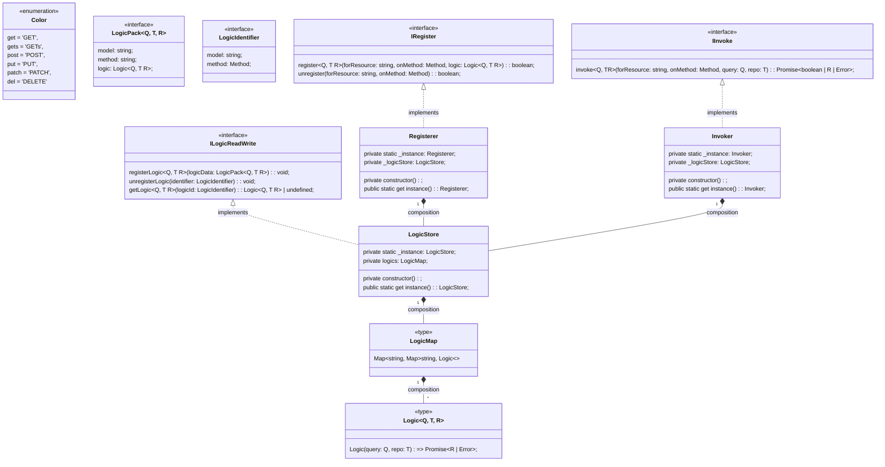

# A lib to register business rules or logics as independent functions

# Installation

```
npm i --save https://github.com/tmukammel/lib-logic-registry.git
```

# Usage

## Registering a logic as a function

```javascript
// core (business rules) layer

// A placeholder or DTO in the core layer
// representing a data object in app layer
export type XYZRes = {
	name: string;
	id: number;
};

interface IRepo<R> {
	get(id: number): R | undefined;
	post(model: R): R | undefined;
	del(id: number): R | undefined;
}

// the app layer

// the example does not clarify how dependency inversion
// is maintained between core and app layers
// hint: may be we can adopt both app layer and core layer interfaces
// in the same infra adapter for repo-orm communication
export class XYZRepo implements IRepo<XYZRes> {
	store: Map<number, XYZRes> = new Map();

	get(id: number): XYZRes | undefined {
		return this.store.get(id) || undefined;
	}
	post(model: XYZRes): XYZRes | undefined {
		this.store.set(model.id, model);
		return this.store.get(model.id);
	}
	del(id: number): XYZRes | undefined {
		const res = this.store.get(id) || undefined;
		if (res) this.store.delete(id);
		return res;
	}
}

// core (business rules) layer
// some-logic.ts

import { Registerer } from 'lib-logic-registry';

export const postLogic: Logic<JSON, XYZRepo, XYZRes | undefined> = async (
	query: JSON,
	repo: XYZRepo
): Promise<XYZRes | undefined | Error> => {
    // let's say we are not registering names with 'Mr' initial
	if (query['name'].startsWith('Mr')) {
		return new Error(`Not registering Males`);
	}
	const res: XYZRes = { name: query['name'], id: query['id'] };
	return repo.post(res);
};

// register the logic
Registerer.instance.register('XYZRes', Method.post, postLogic);
```

## Cleint usage (REST service layer)

```javascript

import { Invoker } from 'lib-logic-registry';

// XYZService.ts
public async post(req: any) {
    repo = new XYZRepo();
    // try to invoke any existing business logic that may be registered
    let res = await Invoker.instance.invoke('<resource name>', Method.post, query, repo);
    if (!res) res = await repo.post(DTO('XYZ', query));
    return res;
}
```

# Background

The reason to create business logic registry is to fascilitate the complete segregation of our application policy (not business rules) code from the business rules, so that the application policy code are decoupled in such a way that we can move them and their related resources and APIs to any other microservice while the business demands shift the microservice bounderies.

## Lib design

### Class diagram [edit](https://mermaid.live/edit#pako:eNq9Vm1v2jAQ_iuWvxSmFAEpDZi20taiDaloHWWaNEWq3MSA1cTOHKcaa-G3z3FeiCGiTKqWL3Hu5XnuzudzXqDHfQIR9AIcxzcULwQOXeZTQTxJOQOzTy5zGVCPtgC3fEG9zTcLzCww3YCXTJc-FxdyFZGrq61E2zZ-JUSsEFAugkQcgVkTXF6BO8FDGpPNFLyCkRBcbIaZ47qGb4Kjw0zKYBNLQdnCMtZZtJta5GsecGGgEpaEROA07yr4gkhwCU4-j2YnliGNc3FclUc81uZ3X-8N-yjJxN9NKZbeUss_zq6_VDU-CVL5zeh2NBud1GYw1ulNCfZ_CCqJWSLKJBFz7Bl1EmRBYyXf7qLaxEaQft1giVFWsDvsPRXKJgLPnPrDLUbCDJQG9QmTdE6JyN3HpWDfWVWthnvs17kahqpNEuaTOWXEP9ApZej73VlbkFB1f4BA1i-VOEMil9yvUeh4d2I7EM82oXcIZqLfB9juJRdGG0SCPmPVGbFUXe2BB8rUinkEVeyH--Y6yRiVh29YcFWNPK7AROIpjEazCpI8Boorp0wPT8HaaNbw7vb0mD3zp2N6mWpDvQeqj-ZcTEnME5EmVxx_ziZG6SywP4xQOYoeOQ8IZqrT3hpKWYziuErnxjVlfgjKYuwU5r2qbXLvZjHNz_E_DI7y3B5Z77rjouLKS51mKs2ZchywAVGTWpHZsXu0tS9D-n-bZJCXyWTL8vpzYceF4MPpqVp9UCutAEhRhurGoemdVfjsXgsXr61WdT4gQMMoIKGaTHGFJVNueUrqepKyeTR8peD78BXlDnwRUB1BPgg0fHHg9rELzdvA0ILqdg8x9dXvju4KF8qlwnIhUsuALpbShS5bK0OcSH6_Yh5EajuJBQVPFkuI5jiI1VcS-Wq385-lUhph9pPzsHDJjEY-VZGUNkR_TvJfrvSl_SB6gb8hOrNbHdtxHLvvdM8GvXPHgiuIOt1Oq9fu2-12xxkMBudde23BP5qp02r37J7Tcbrndn_QP2vb67_9gBh2)


